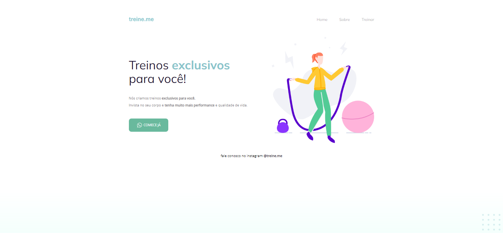

# EXPLORER

> Curso Explorer

Projeto desenvolvido pelo curso Explorer da Rocketseat

🔗 [Clique aqui para acessar o projeto](https://mayrochinha.github.io/segundo-projeto-explorer/)

## 💻 Tecnologias:
- HTML
- CSS
- Git e Github

## 💁‍♀️ Contato:

pricilamayara.rocha@gmail.com